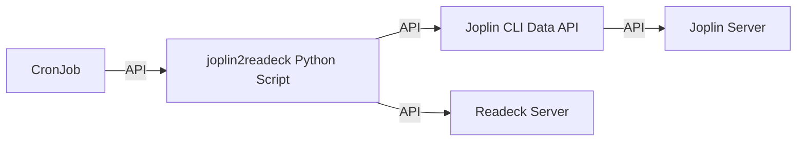
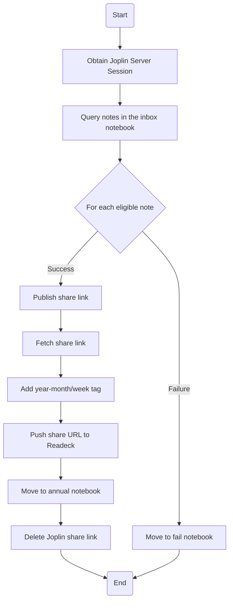

# Publish Joplin Notes to Readeck for Easy Reading

This project helps you publish your Joplin notes to Readeck, so you can easily read them as EPUB files on your e-ink reader (if your device browser supports EPUB download).

## Prerequisites

- You must already have a running **Joplin Server**
- You must already have a running **Readeck Server**

## Setup Instructions

### 1. Build the Joplin CLI Data API Server

Navigate to the `joplin-cli-server` folder and follow its instructions to set up the Joplin CLI Server.

### 2. Build the `joplin2readeck` Python Script Docker Image

```
docker build . -t joplin2readeck:1.0.0
docker run --env-file=.env --rm -it joplin2readeck:1.0.0 /bin/bash
docker tag joplin2readeck:1.0.0 localhost:32000/joplin2readeck:1.0.0
docker push localhost:32000/joplin2readeck:1.0.0
docker compose build
docker compose up
```

### 3. Create the `joplin2readeck` CronJob on Kubernetes

```
kubectl apply -f joplin2readeck-*.yaml
kubectl get cronjob -n joplin-cli
kubectl describe cronjob joplin2readeck-cron -n joplin-cli
```

## Notes

- If your e-ink reader supports downloading EPUBs from your browser, you can use Readeck to access your notes easily.
- Make sure to set up all necessary environment variables in your `.env` file as required by your setup.

---

Feel free to suggest improvements or ask questions by opening an issue in this repository!

---

## Architecture Diagram



## Flowchart



### Process Description

1. When started, environment variables are used to configure Joplin and Readeck API endpoints.
2. A session is established with the Joplin Server.
3. Notes created recently in the specified notebook (e.g., "inbox") are queried (with time filters).
4. For each note:
    - Publish a Joplin share link.
    - Fetch the share URL.
    - Add a year-month/week tag in Joplin.
    - Push the share URL to Readeck, making it available for EPUB reading.
    - On success, move the note to the annual notebook; on failure, move to the fail notebook.
    - Delete the Joplin share link to avoid duplication.
5. The entire process is triggered automatically and periodically by a Kubernetes CronJob, ensuring consistent synchronization.

---